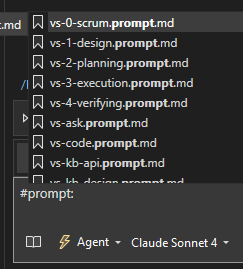
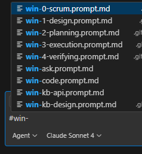

# Usage

Copilot would only work after executing [the script](https://github.com/vczh-libraries/Tools/blob/master/Copilot/copilotInit.ps1):
- For Visual Studio Code, run the script in any folder.
- For Visual Studio, run the script in the solution folder, it will also update the `*.sln` file to offer context. Since Copilot in Visual Studio is difficult in locating files.
- After the script is executed, supporting files will be able to commit to the repo. So you don't have to run it everytime you switch between branches or clone.

To initialize a code change, use `0-scrum.prompt.md` and type your problem in chat, with `# Problem`.
- `win-` is for Visual Studio Code running on Windows. You need to type `#win-0-scrum.prompt.md` to use it.
- `vs-` is for Visual Studio. You need to type `#prompt:vs-0-scrum.prompt.md` to use it.
  
The `prompts` folder copies all task in Visual Studio github copilot recognized format.
- [0-scrum.prompt.md](prompts/win-0-scrum.prompt.md) creates `Copilot_Scrum.md`.
  - Use `# Problem` for the problem.
- [1-design.prompt.md](prompts/win-1-design.prompt.md) creates `Copilot_Task.md`.
  - Use `# Problem` for the problem. If the problem is `Complete Task No.X`, it will find the task description in `Copilot_Scrum.md`.
- [2-planning.prompt.md](prompts/win-2-planning.prompt.md) creates `Copilot_Planning.md`.
- [3-summarizing.prompt.md](prompts/win-3-summarizing.prompt.md) creates `Copilot_Execution.md`.
- [4-execution.prompt.md](prompts/win-3-execution.prompt.md) edit source files according to `Copilot_Execution.md`.
- [5-verifying.prompt.md](prompts/win-5-verifying.prompt.md) compiles and runs unit test.
- [ask.prompt.md](prompts/win-ask.prompt.md) offers insights about the source code.
- [code.prompt.md](prompts/win-code.prompt.md) update the source code directly, without having to go through all the process.
- [kb-api.prompt.md](prompts/win-kb-api.prompt.md) make change to the [knowledge base](KnowledgeBase/Index.md), for api document.
- [kb-design.prompt.md](prompts/win-kb-design.prompt.md) creates `Copilot_KB.md` and make change to the [knowledge base](KnowledgeBase/Index.md), for high-level api/design document.
- You can always use `# Update` in any phrase for adjustment.

## Demo

The `sampleLogFiles` folder copies generated document files for a simple task as a demo.
It is a scrum with several tasks. Each folder contains documents created from each task.
Only [Copilot_Scrum.md](TaskLogs/Copilot_Scrum.md) and [Copilot_KB.md](TaskLogs/Copilot_KB.md) will be kept, all other documents will be deleted when `1-design.prompt.md` is activated for a new task.

Check out demo logs:

- [Copilot_KB.md](sampleLogFiles/Copilot_KB.md)
- [Copilot_Scrum.md](sampleLogFiles/Copilot_Scrum.md)
- Task-1/
  - [Copilot_Execution.md](sampleLogFiles/Task-1/Copilot_Execution.md)
  - [Copilot_Planning.md](sampleLogFiles/Task-1/Copilot_Planning.md)
  - [Copilot_Task.md](sampleLogFiles/Task-1/Copilot_Task.md)
- Task-2/
  - [Copilot_Execution.md](sampleLogFiles/Task-2/Copilot_Execution.md)
  - [Copilot_Planning.md](sampleLogFiles/Task-2/Copilot_Planning.md)
  - [Copilot_Task.md](sampleLogFiles/Task-2/Copilot_Task.md)
- Task-3/
  - [Copilot_Execution.md](sampleLogFiles/Task-3/Copilot_Execution.md)
  - [Copilot_Planning.md](sampleLogFiles/Task-3/Copilot_Planning.md)
  - [Copilot_Task.md](sampleLogFiles/Task-3/Copilot_Task.md)

### In Visual Studio

### In Visual Studio Code

