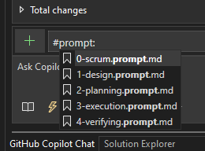

# Usage

- Copilot would only work after executing the following script in the `UnitTest.sln` folder:
  - `Tools\Copilot\copilotInit.ps1`
  - `Tools` is the `Tools` repo under the same github organization.
- To initialize a code change, use `#prompt:0-scrum.prompt.md` and type your problem in chat, with `# Problem`.
- The `prompts` folder copies all task in Visual Studio github copilot recognized format.
  - `0-scrum.prompt.md` creates `Copilot_Scrum.md`.
    - Use `# Problem` for the problem.
  - `1-design.prompt.md` creates `Copilot_Task.md`.
    - Use `# Problem` for the problem. If the problem is `Complete Task a-b`, it will find the problem in `Copilot_Scrum.md`.
  - `2-planning.prompt.md` creates `Copilot_Planning.md`.
  - `3-execution.prompt.md` and `4-verifying.prompt.md` create `Copilot_Execution.md`.
  - `4-verifying.prompt.md` compiles and runs unit test.
  - You can always use `# Update` in any phrase for adjustment.

## Demo

The `sampleLogFiles` folder copies generated document files for a simple task as a demo.
It is a scrum with 3 tasks. Each folder contains documents created from each task.
Only `Copilot_Scrum.md` will be kept, all other documents will be deleted when `1-design.prompt.md` is activated for a new task.

